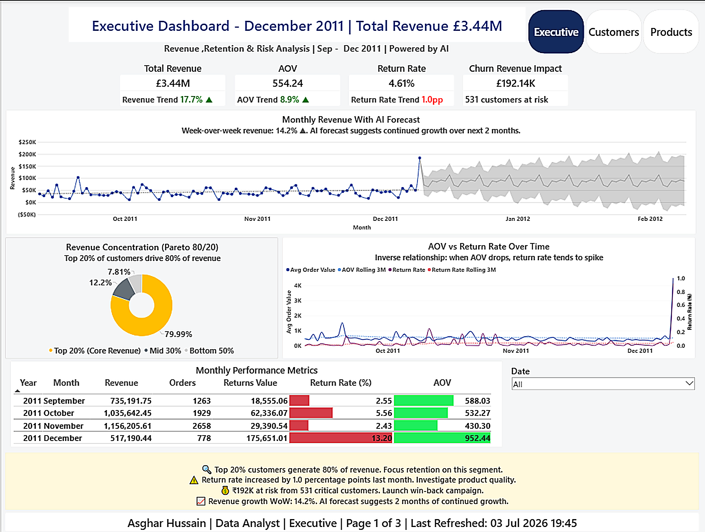
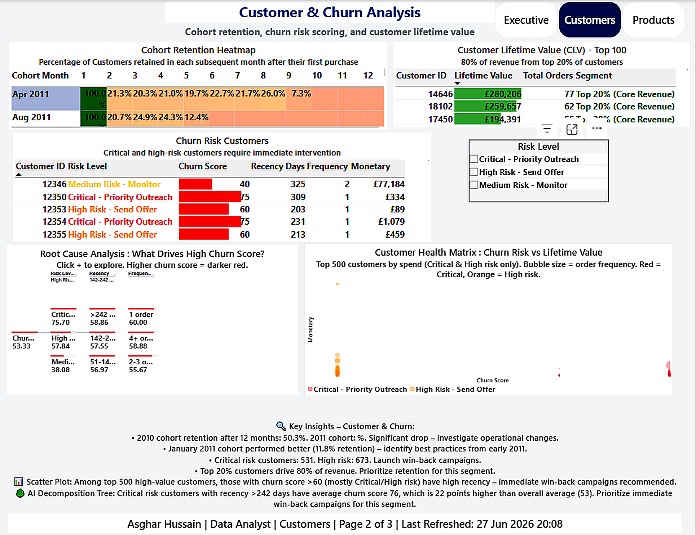
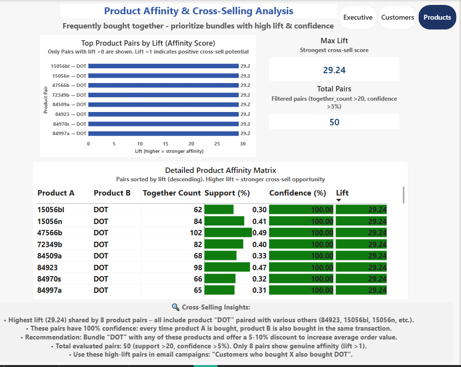

# 🚀 From Raw Data to Revenue-Saving Decisions

**An End-to-End E-Commerce Analytics Pipeline: Excel → PostgreSQL → Power BI**



---

## 📌 The Story Behind This Project

Every e-commerce business sits on a mountain of data but struggles to find actionable insights. This project was born from that exact challenge. I took **~540,000 raw transactions** from a UK-based online retailer (2010–2011) and transformed them into a **decision-making engine** for three key business functions:

- **👑 Executive Leadership** – *"How healthy is our business right now?"*
- **📊 Marketing & Retention** – *"Who is leaving, and how do we stop it?"*
- **🛒 Product Teams** – *"What products should we bundle to increase revenue?"*

This wasn't just about building charts. It was about answering real business questions with data.

---

## 🔥 Key Business Insights & Actions (The "So What?")

Here's what the data actually told me, and what I would do about it:

| 💡 Insight | 📊 What the Data Says | 🚀 Business Action |
| :--- | :--- | :--- |
| **The 80/20 Rule is Real** | The top 20% of customers drive **79.99%** (£7.1M) of the total £9.7M revenue. | Launch a **VIP Loyalty Program**. These customers are your golden geese – protect them. |
| **The Churn Firehose** | We've identified **531 Critical** and **673 High-Risk** customers. If we don't act, we lose **£192K**. | Immediate **win-back campaigns**. Offer 20% off to users inactive for over 90 days. |
| **AI Finds the Root Cause** | Critical-risk customers with **recency >242 days** have an average churn score of **75.67** (vs. the 53 average). | Stop generic emails. Target the **"Old & Critical"** segment with personalized reactivation offers. |
| **The "DOT" Effect** | Discovered **8 product pairs** with a massive **Lift of 29.24** (e.g., `84923 → DOT`). | Create **product bundles**. "Buy X & DOT, get 10% off" to increase average order value. |
| **Guest Checkout Trap** | Guest users have a **16.5%** return rate, compared to just **6.8%** for Registered users. | Simplify guest checkout (reduce friction) and incentivize guests to create accounts. |
| **Retention is Crumbling** | 2010 cohort retained **50.3%** after 12 months. 2011 cohort retained just **11.8%**. | Investigate operational/service changes between 2010 and 2011. Fix the declining loyalty. |

---

## 📊 Dashboard Walkthrough (3 Pages, 1 Mission)

### Page 1: Executive Summary (For the CEO & Leadership)
This page answers the first question any leader asks: *"How are we doing?"*

- **Top KPIs:** Total Revenue (**£3.44M**), Average Order Value (**£554**), Return Rate (**4.61%**), and Revenue at Risk (**£192K**).
- **Revenue Trend:** An AI forecast (2-month ahead) with Week-over-Week growth (**+14.2%**) to show momentum.
- **Pareto (80/20):** A donut chart visually proving that 20% of customers are the engine of the business.


### Page 2: Customer & Churn (For Marketing & Retention Teams)
This page answers: *"Who is leaving, and why?"*

- **Cohort Retention:** A heatmap showing the dramatic drop in retention (2010: 50% → 2011: 12%).
- **Customer Health Matrix:** A scatter plot (Top 500 spenders, Critical/High risk only) to visually prioritize who to save first.
- **AI Decomposition Tree:** Automatically detects the root cause of high churn (Critical + Recency >242 days).
> **Note:** The AI Decomposition Tree on this page is fully interactive. Hover over the visual and click the **Focus Mode** icon (diagonal arrows) to explore all drill-down paths and root causes in detail.



### Page 3: Product Affinity (For Product & E-Commerce Teams)
This page answers: *"What products are frequently bought together?"*

- **Top Product Pairs:** 8 high-lift pairs with a **Lift of 29.24**.
- **Hero Product:** Product "DOT" appears in every high-lift pair – a golden opportunity for bundling.
- **Actionable List:** A detailed table with support, confidence, and lift metrics for product managers.



---

## 🛠️ The Technical Architecture (How I Built It)

I designed this as a real-world data pipeline, not a one-off analysis.

### Phase 1: 📊 Excel (Data Preparation)
- **Task:** Cleaned the messy raw CSV files (removed duplicates, standardized date formats).
- **Feature Engineering:** Created calculated columns to enrich the data:
  - `TotalAmount` = Quantity × UnitPrice
  - `Return_Flag` = "Return" if Quantity < 0, otherwise "Sale"
  - `Customer_Type` = "Guest" if CustomerID is missing, otherwise "Registered"
- **EDA:** Built PivotTables to quickly spot initial trends (e.g., Guests have a 16.5% return rate vs. 6.8% for Registered users).

### Phase 2: 🗄️ PostgreSQL (Deep Business Logic)
- **Task:** Loaded the cleaned data and performed complex calculations impossible in Excel.
- **Key Objects:** Built **5 advanced Views** (using CTEs and Window Functions) for:
  - Executive KPIs (`vw_executive_kpi`)
  - Customer Lifetime Value & Pareto (`vw_clv_pareto`)
  - Cohort Retention (`vw_cohort_retention`)
  - Churn Risk Scoring (`vw_churn_risk`)
  - Product Affinity (Materialized View: `mv_product_affinity`)
- **Performance:** Added indexes to handle 500k+ rows efficiently.

### Phase 3: 📈 Power BI (Interactive Storytelling)
- **Task:** Visualized the data for business users.
- **Key Features:** Dynamic titles, AI-powered visuals (Forecast & Decomposition Tree), advanced DAX measures (80/20 Pareto, WoW Growth), custom navigation buttons, and drill-through capabilities.

---

## 🗂️ Repository Structure (Where Everything Lives)

```

ecommerce-analytics-project/
│
├── data/
│   ├── online-retail-data.zip       # Raw + Cleaned CSV (unzip before use)
│   └── exports/                     # View results (CSV)
│       ├── vw-executive-kpi.csv
│       ├── vw-clv-pareto.csv
│       ├── vw-cohort-retention.csv
│       ├── vw-churn-risk.csv
│       └── mv-product-affinity.csv
│
├── sql/
│   ├── 01-schema.sql                # Table creation
│   ├── 02-views.sql                 # 5 Advanced Views + Materialized View
│   └── 03-indexes.sql               # Performance optimization
│
├── powerbi/
│   └── ecommerce-dashboard-2026.pbix # Final dashboard
│
├── excel-analysis/
│   └── ecommerce-eda-pivots.xlsx    # EDA with Pivot Tables & Charts
│
├── screenshots/
│   ├── page1-executive-summary.png
│   ├── page2-customer-churn.png
│   └── page3-product-affinity.png
│
├── docs/
│   └── ecommerce-dashboard-walkthrough.pdf
│
├── .gitignore
└── README.md                         # This file

```

---

## 🛠️ Tech Stack (The Tools I Used)

- **Data Processing & EDA:** Microsoft Excel (Power Query, Formulas, Pivot Tables)
- **Data Warehouse & Analytics:** PostgreSQL (SQL, CTEs, Window Functions, Materialized Views)
- **Visualization & Reporting:** Power BI (DAX, AI Visuals, Bookmarks, Drill-through)
- **Version Control & Portfolio:** Git & GitHub

---

## 🚀 How to Reproduce This Project

If you want to run this project on your own machine, follow these steps:

1.  **Clone the repository:**
    ```bash
    git clone https://github.com/asghar-dataanalyst/ecommerce-analytics-project.git
    ```

2.  **Extract the data:**
    - Unzip `data/online-retail-data.zip` to get the `online-retail-cleaned.csv` file.
    - You can discard the raw CSV (provided for reference).

3.  **Set up the PostgreSQL database:**
    - Create a new database (e.g., `online_retail_db`).
    - Run the SQL scripts in the `sql/` folder in this order:
      1. `01-schema.sql` (Creates the main table)
      2. `02-views.sql` (Creates the analytical views)
      3. `03-indexes.sql` (Adds performance indexes)

4.  **Load the data:**
    - Use the PostgreSQL `COPY` command to load the cleaned CSV into the `online_retail` table.

5.  **Open the Power BI dashboard:**
    - Open `powerbi/ecommerce-dashboard-2026.pbix` in Power BI Desktop.
    - Change the data source connection to your local PostgreSQL server.
    - Refresh the data and explore the dashboard.

---

## 👨‍💻 About the Author

Hi, I'm **Asghar Hussain** – a data analyst passionate about turning complex data into clear, actionable business stories. I built this project to demonstrate my ability to handle the complete analytics lifecycle, from messy raw data to interactive executive dashboards.

[](https://linkedin.com/in/your-profile) 
[](https://github.com/asghar-dataanalyst)

📊 **[Download Project Presentation (PDF)](docs/ecommerce-dashboard-walkthrough.pdf)**

---

⭐ **If you found this project helpful or interesting, please star the repository!
```
